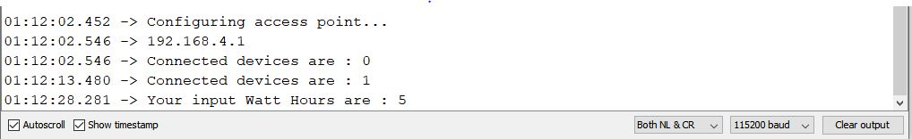

# EV_Charger_monetization
Internship under Magnes Motors

# TABLE OF CONTENTS
- [HTTP Webserver on Arduino IDE](#http-webserver-on-arduino-ide)
- [Remotes and Local Repositories](#remote-repositories)
  - [Local Remotes](#adding-your-local-repository-as-a-remote)
  - [Fetching from and Pushing to Remotes](#fetching-and-pushing)
- [Three States of a Git file](#states-of-a-git-file)
- [Pulling and Pushing](#git-pull-and-git-push)
- [Undoing commits](#undoing-commits)
- [Git Branching](#git-branching)

# HTTP Webserver on Arduino IDE

## 1. Flash Code to ESP32

  
   

## 2. Connect to WiFi AP "Magnes" using an Android Device

## 3. Go to "http://192.168.4.1" in browser through Android

  
   

## 4. Input Watthours and press 'Submit'

  
   

## 5. Charge is displayed on the webpage

  
   

  
## 6. Press Back

