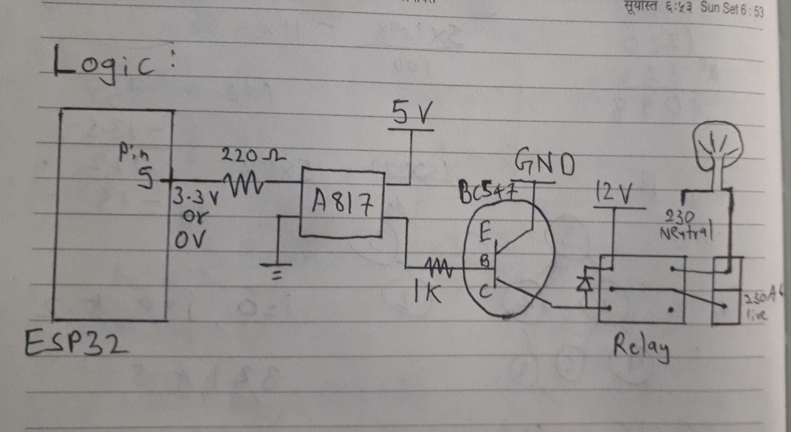
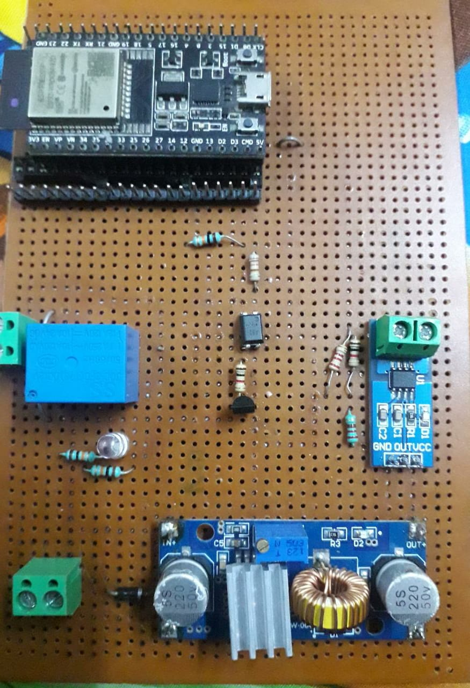

# Final Report

## Instructions:

1. you need to add following zip libraries in arduino library:
	- [ESPAsyncWebServer-master.zip](ESPAsyncWebServer-master.zip)
	- [AsyncTCP-master.zip](AsyncTCP-master.zip)

2. Change ssid and password according to your wifi in the code and then upload the code to esp32.

3. Now open the serial monitor in arduino ide, copy the ip address given there and paste it in google chrome tab. 
Enter your name, required ON time in minutes and current value the power outlet will have started working in arduino serial monitor, you will get the amount to be paid. 
**NOTE:** if you by mistakely entered a greater value in minutes, in pcb board, press the switch to restard esp, in design board, power off the adapter and on it again to restart esp. you dont need to flash the code again.

***Precautions:*** Don't touch the pcb board when live ac current is connected to the relay of the board.

## Circuit Diagrams

**If having any doubts in circuit design
Contact Akshat Bhanushali
8080252000**

## improvement areas

1. current sensor needs be included
2. esp wifi module needs to be used instead of whole esp dev kit
3. remove 7A relay and include 16A omron relay in pcb design
4. include smps so that another socket is not required for adapter
5. restart the esp by giving commands over wifi

## Members:
1. Akshat B.
2. Dhruva G.
3. Anushree S.
